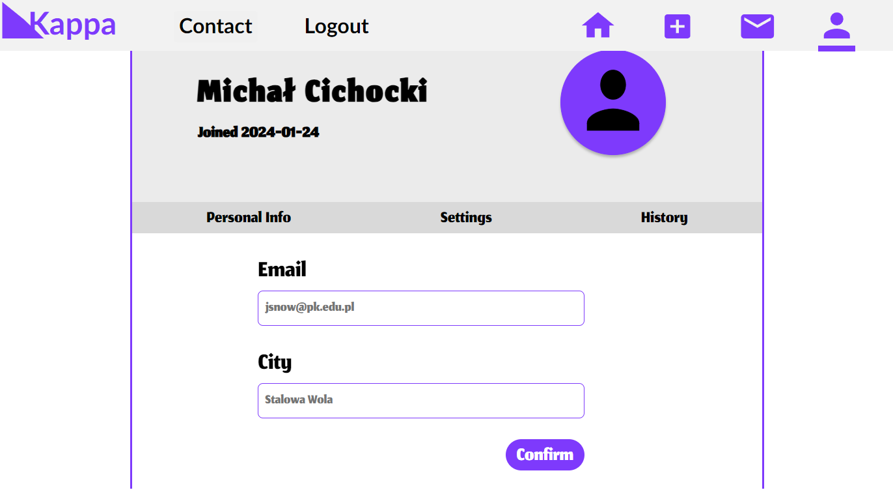
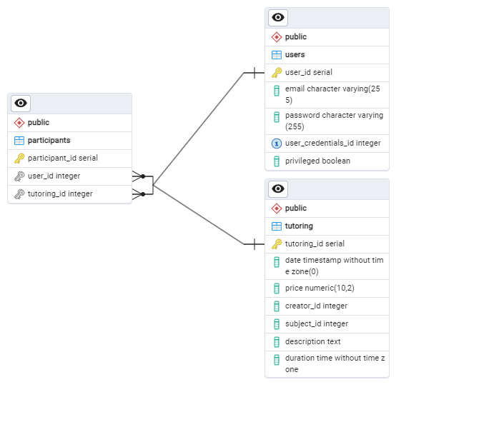

# Aplikacja do Zapisywania się na Korepetycje

## Opis

Aplikacja do zapisywania się na korepetycje to narzędzie, które umożliwia użytkownikom łatwe i wygodne rejestracje na prywatne lekcje. Aplikacja ma na celu ułatwienie procesu zarówno dla uczniów, jak i nauczycieli, zapewniając przejrzysty sposób umawiania się na korepetycje.

### Funkcje Aplikacji

- **Rejestracja Użytkownika:**
  1. Utwórz, podając swoje dane kontaktowe.
  2. Hashowanie danych Bcrypt
     ### Panel Rejestracji
      

- **Umawianie się na Korepetycje:**
  1. Uczniowie mogą przeglądać dostępnych nauczycieli i terminy.
  2. Wybierz nauczyciela i termin, który ci odpowiada.
  3. Potwierdź rezerwację.
     ### Panel Umawiania się na korepetycje
      

  - **Panel tworzenie korepetycji:**
    1. Szybko i wygodnie twórz nowe korepetycje dla swoich uczniów.
       ### Panel tworzenia korepetycji
      

- **Kalendarz i Powiadomienia:**
  - Użytkownicy mogą śledzić swoje korepetycje w kalendarzu.
  - Otrzymuj powiadomienia o nadchodzących lekcjach.

- **Edycja Danych Użytkownika:**
  - Użytkownicy mogą edytować swoje dane, dostosowując je do bieżących potrzeb.
     ### Edycja Danych Osobistych
      

- **Panel Administracyjny:**
  - Istnieje panel administracyjny umożliwiający zarządzanie użytkownikami, korepetycjami i innymi aspektami aplikacji.
    ### Panel Administracyjny
      

## Diagramy ERD

### Ogólny Diagram ERD

### Diagramy Relacji
- **Many-to-Many:**
  

- **One-to-Many:**
  

- **One-to-One:**
  
